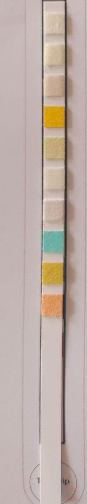

# Urine Strip Analyzer

Urine Strip Analyzer is a web application that allows users to upload an image of a urine strip and identify the colors on the strip using computer vision techniques. The application is built using Python, Django, OpenCV, HTML, and CSS.

## Features

- Upload an image of a urine strip.
- Analyze the image to detect the colors on the strip.
- Return the RGB values of the detected colors as a JSON response.
- Store the analyzed colors in a database.

## Technologies Used

- Python
- Django
- OpenCV
- HTML
- CSS

## Installation

1. Clone the repository:

   ```bash
   git clone https://github.com/your-username/urine-strip-analyzer.git

2. Create a virtual environment:

3. Install the dependencies:

   ```bash
   pip install -r requirements.txt

4. Run the application:
   ```bash
   python manage.py runserver

## Screenshots

Here are some screenshots of the Urine Strip Analyzer in action:



*Urine Strip*


*Upload Page*


*Analysis Result*
